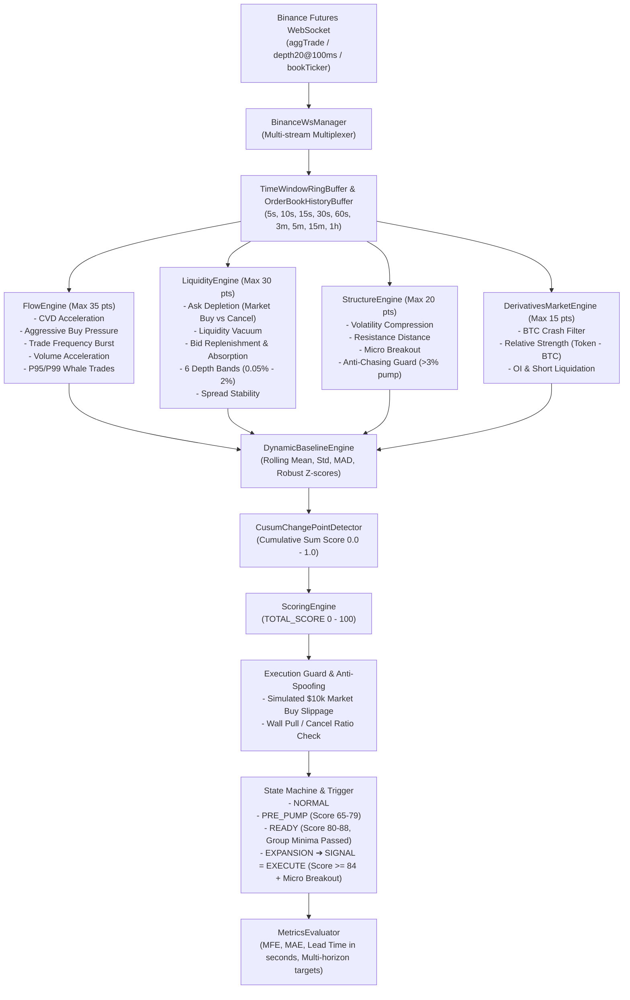

# Binance Early Expansion Detector (crypto-spike-bot)

A high-performance real-time microstructure trading detector built for Binance Perpetual Futures. It detects the **exact behavioral transition** where a coin prepares to explode into an expansion wave *before* the large price candle prints.

```text
NORMAL ➔ ACCUMULATION / ABSORPTION ➔ PRE-EXPANSION ➔ READY ➔ MICRO BREAKOUT ➔ EXPANSION
```

---

## 1. Core Architecture

The system operates on live microsecond order-flow streams, multi-window sliding circular buffers, coin-specific rolling Z-scores, statistical change-point detection, independent score groups with strict caps, and simulated order book execution guards.



---

## 2. Independent Group Scores & Group Caps

Correlated features are grouped together and capped to prevent multiple correlated indicators from over-inflating confidence.

| Group | Max Score | Components & Weights |
| :--- | :---: | :--- |
| **FLOW** | **35** | Aggressive Buy Accel (25%), CVD Accel (25%), Trade Burst (15%), Volume Accel (15%), Large Aggressive Buys (20%) |
| **LIQUIDITY** | **30** | Ask Depletion (30%), Liquidity Vacuum (25%), Bid Replenishment (20%), Book Imbalance (15%), Spread Stability (10%) |
| **STRUCTURE** | **20** | Volatility Compression (25%), Resistance Distance (20%), Price Accel (20%), Micro Breakout (20%), Multi-TF Alignment (15%) |
| **DERIVATIVES** | **10** | OI Accel (35%), Short Liquidation (30%), OI/Price Relationship (25%), Funding Context (10%) |
| **MARKET** | **5** | BTC Regime (Bullish/Neutral vs Crash, 50%), Relative Strength (50%) |
| **TOTAL** | **100** | Strict minimum per-group threshold required for READY/EXECUTE |

---

## 3. Core Behavioral Safeguards

1. **Ask Depletion vs Quote Pulling (Spoofing)**:
   - Ask depletion is only credited if backed by aggressive market buy trade volume eating the orders. If ask depth drops without trade execution, it is flagged as quote pulling (manipulation score penalization).
2. **Anti-Chasing Guard**:
   - If price has already pumped `> 3.0%` from base or `returns_5m >= 3%`, the entry is severely penalized to eliminate chasing the top of candles.
3. **Simulated Slippage Execution Filter**:
   - Simulates a market buy of $10,000 against actual order book asks. If slippage exceeds 0.35%, the signal is rejected.
4. **BTC Crash Regime Filter**:
   - If BTC 5m return `< -1.8%` or 1m return `< -0.9%`, all altcoin long signals are immediately rejected.

---

## 4. Signal Output Schema (Spec Section 50)

```json
{
  "symbol": "BTCUSDT",
  "state": "EXPANSION",
  "flowScore": 32,
  "liquidityScore": 26,
  "structureScore": 18,
  "derivativeScore": 8,
  "marketScore": 4,
  "totalScore": 88,
  "changePointScore": 0.85,
  "cvdAcceleration": 500.0,
  "buyPressure": 0.82,
  "tradeBurst": 15.0,
  "volumeZ": 4.2,
  "askDepletion": 0.70,
  "liquidityVacuum": 0.80,
  "oiAcceleration": 1.2,
  "shortLiquidationAcceleration": 2.1,
  "spread": 0.02,
  "estimatedSlippage": 0.05,
  "manipulationScore": 0.05,
  "probability_1pct_30s": 0.88,
  "probability_2pct_60s": 0.79,
  "expectedMFE": 3.08,
  "expectedMAE": 0.45,
  "leadTimeEstimate": 12.5,
  "execution": "PASS",
  "signal": "EXECUTE"
}
```

---

## 5. Development & Testing

```bash
# Install dependencies
npm install

# Run unit & integration tests
npm test

# Run build
npm run build

# Run linter
npm run lint

# Start server
npm run start:dev
```
